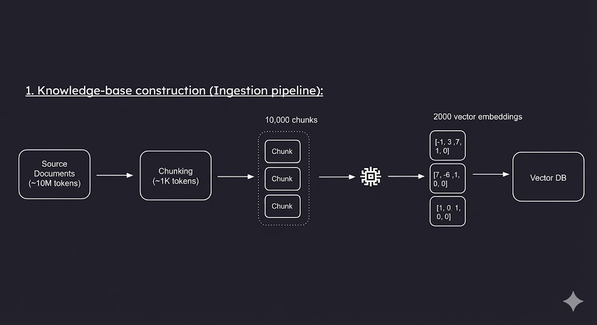

# 🚀 Multimodal RAG Pipeline

> **Advanced Retrieval-Augmented Generation (RAG) system with intelligent chunking, vector embeddings, and semantic search capabilities**

[](https://www.python.org/)
[](https://www.langchain.com/)
[](https://www.trychroma.com/)

---

## 📋 Table of Contents

- [Overview](#-overview)
- [Architecture](#-architecture)
- [Features](#-features)
- [Project Structure](#-project-structure)
- [Installation](#-installation)
- [Usage](#-usage)
- [Chunking Methods](#-chunking-methods)
- [Pipeline Components](#-pipeline-components)
- [Configuration](#-configuration)
- [Contributing](#-contributing)
- [License](#-license)

---

## 🎯 Overview

This **Multimodal RAG Pipeline** is a sophisticated document retrieval and question-answering system that combines:

- 🧠 **Advanced Chunking Strategies** - Multiple text splitting methods for optimal context preservation
- 🔍 **Semantic Search** - Vector embeddings using HuggingFace Transformers
- 💾 **Persistent Vector Storage** - ChromaDB for efficient similarity search
- 🤖 **LLM Integration** - OpenAI GPT models for intelligent answer generation
- 📚 **Multi-Document Support** - Process and query across multiple knowledge sources
- ⚡ **History-Aware Generation** - Context-aware conversational retrieval

---

## 🏗️ Architecture

### 1️⃣ Knowledge Base Construction (Ingestion Pipeline)

The ingestion pipeline processes source documents through chunking, embedding, and storage:



**Pipeline Flow:**
1. **Source Documents** (~10M tokens) → Raw text files from various sources
2. **Chunking** (~1K tokens) → Intelligent text splitting with configurable chunk sizes
3. **Embedding** → Convert chunks into 2000-dimensional vector embeddings
4. **Vector DB** → Store embeddings in ChromaDB with cosine similarity indexing

---

### 2️⃣ Retrieval Pipeline

The retrieval pipeline handles user queries and generates contextual answers:


**Pipeline Flow:**
1. **User Query** → Natural language question input
2. **Query Embedding** → Convert query to vector representation
3. **Similarity Search** → Retrieve top-K most relevant chunks from Vector DB
4. **Context Assembly** → Combine retrieved chunks with query
5. **LLM Generation** → Generate accurate, context-aware answers

---

## ✨ Features

| Feature | Description |
|---------|-------------|
| 🔄 **Multiple Chunking Methods** | Character-based, Semantic, and Agentic chunking strategies |
| 🎯 **Semantic Search** | Sentence-Transformers for high-quality embeddings |
| 💬 **Conversational RAG** | History-aware generation for multi-turn conversations |
| 📊 **Rich Document Support** | Process `.txt`, `.pdf`, and structured documents |
| ⚙️ **Configurable Pipeline** | Customizable chunk sizes, overlap, and retrieval parameters |
| 🔐 **Environment Management** | Secure API key handling with `.env` configuration |
| 🚀 **Production Ready** | Persistent storage, error handling, and logging |

---

## 📂 Project Structure

```
RAG/
├── 📁 RAG pipeline/
│   ├── ingestion_pipeline.py      # Document loading, chunking, and embedding
│   ├── retrieval_pipeline.py      # Query processing and document retrieval
│   ├── answer_generation.py       # LLM-based answer generation
│   └── history_aware_generation.py # Conversational RAG with context
│
├── 📁 Chunking Method/
│   ├── character_text_splitter.py # Basic character-based chunking
│   ├── sematic_text_splitter.py   # Semantic chunking (meaning preservation)
│   └── agentic_chunking.py        # AI-powered intelligent chunking
│
├── 📁 docs/
│   ├── google.txt                 # Google company information
│   ├── microsoft.txt              # Microsoft company information
│   ├── nvidia.txt                 # NVIDIA company information
│   ├── spacex.txt                 # SpaceX company information
│   ├── tesla.txt                  # Tesla company information
│   └── paper.pdf                  # Research paper (multimodal)
│
├── 📁 database/                   # Cached embeddings and vector stores
├── 📁 db/                         # ChromaDB persistent storage
│
├── 📓 multi_modal_rag.ipynb       # Interactive Jupyter notebook demo
├── 📄 requirements.txt            # Python dependencies
├── 🔒 .env                        # Environment variables (API keys)
├── 🚫 .gitignore                  # Git ignore configuration
└── 📖 README.md                   # This file
```

---

## 🛠️ Installation

### Prerequisites

- **Python 3.11+** 🐍
- **pip** package manager
- **OpenAI API Key** (for LLM generation)

### Step 1: Clone the Repository

```bash
git clone https://github.com/yourusername/multimodal-rag-pipeline.git
cd multimodal-rag-pipeline
```

### Step 2: Create Virtual Environment

```bash
# Create virtual environment
python -m venv .venv

# Activate virtual environment
# Windows (PowerShell)
.venv\Scripts\Activate.ps1

# Linux/Mac
source .venv/bin/activate
```

### Step 3: Install Dependencies

```bash
pip install -r requirements.txt
```

### Step 4: Configure Environment Variables

Create a `.env` file in the project root:

```env
# OpenAI Configuration
OPENAI_API_KEY=your_openai_api_key_here

# Optional: Model Configuration
OPENAI_MODEL=gpt-4-turbo-preview
EMBEDDING_MODEL=sentence-transformers/all-MiniLM-L6-v2

# Optional: Database Configuration
CHROMA_PERSIST_DIR=db/chroma_db
```

---

## 🚀 Usage

### 1️⃣ Build Knowledge Base (Ingestion)

Process documents and create vector embeddings:

```bash
python "RAG pipeline/ingestion_pipeline.py"
```

**This will:**
- ✅ Load all documents from the `docs/` folder
- ✅ Split documents into optimized chunks
- ✅ Generate vector embeddings using HuggingFace models
- ✅ Store embeddings in ChromaDB at `db/chroma_db/`

### 2️⃣ Query Documents (Retrieval)

Search for relevant information:

```bash
python "RAG pipeline/retrieval_pipeline.py"
```

**Example Query:**
```python
query = "What was NVIDIA's first graphics accelerator called?"
```

**Output:**
```
User Query: What was NVIDIA's first graphics accelerator called?
--------------------------------------------------
Document 1:
NVIDIA's first product was the NV1, released in 1995...

Document 2:
The NV1 was a multimedia graphics accelerator...
```

### 3️⃣ Generate Answers (RAG)

Get AI-generated answers from your documents:

```bash
python "RAG pipeline/answer_generation.py"
```

**Features:**
- 🤖 Uses retrieved context to generate accurate answers
- 📝 Cites source documents
- ⚡ Handles multi-document queries

### 4️⃣ Conversational RAG

Interactive question-answering with conversation history:

```bash
python "RAG pipeline/history_aware_generation.py"
```

**Features:**
- 💬 Multi-turn conversations
- 🧠 Context-aware follow-up questions
- 🔄 Automatic conversation history management

### 5️⃣ Jupyter Notebook Demo

Explore the interactive demo:

```bash
jupyter notebook multi_modal_rag.ipynb
```

---

## 🧩 Chunking Methods

The project implements three sophisticated chunking strategies:

### 1. Character Text Splitter 📝

**File:** `Chunking Method/character_text_splitter.py`

**Strategy:** Fixed-size character-based chunking with overlap

```python
chunk_size = 800 characters
chunk_overlap = 0 characters
```

**Best For:**
- ✅ General text documents
- ✅ Uniform content structure
- ✅ Quick prototyping

---

### 2. Semantic Text Splitter 🧠

**File:** `Chunking Method/sematic_text_splitter.py`

**Strategy:** Meaning-preserving chunks based on semantic boundaries

```python
- Preserves sentence structure
- Maintains context coherence
- Respects document sections
```

**Best For:**
- ✅ Complex documents
- ✅ Technical documentation
- ✅ Narrative text

---

### 3. Agentic Chunking 🤖

**File:** `Chunking Method/agentic_chunking.py`

**Strategy:** AI-powered intelligent chunking using LLM analysis

```python
- Identifies logical sections
- Preserves topic coherence
- Adapts to content type
```

**Best For:**
- ✅ Mixed content types
- ✅ Research papers
- ✅ Maximum accuracy

---

## ⚙️ Pipeline Components

### 🔵 Ingestion Pipeline

**Purpose:** Transform raw documents into searchable vector embeddings

**Key Functions:**

```python
load_documents(docs_path="docs")              # Load all text files
split_documents(documents, chunk_size=800)    # Chunk documents
create_vector_store(chunks, persist_dir)      # Create ChromaDB
```

**Technologies:**
- `LangChain` - Document processing framework
- `HuggingFace Embeddings` - Sentence transformers
- `ChromaDB` - Vector database with HNSW indexing

---

### 🟢 Retrieval Pipeline

**Purpose:** Find relevant document chunks for user queries

**Key Features:**

```python
# Initialize retriever
retriever = db.as_retriever(search_kwargs={"k": 5})

# Retrieve top-5 relevant chunks
relevant_docs = retriever.invoke(query)
```

**Similarity Metric:** Cosine similarity in embedding space

---

### 🟡 Answer Generation

**Purpose:** Generate accurate answers using retrieved context

**Technologies:**
- `OpenAI GPT-4` - Language model
- `LangChain` - Prompt engineering and chains
- `Context Injection` - Retrieval-augmented prompts

**Example Prompt Template:**

```python
system_message = """
You are an expert assistant. Use the following context 
to answer the user's question accurately.

Context: {context}
"""
```

---

### 🟣 History-Aware Generation

**Purpose:** Multi-turn conversational RAG with context memory

**Features:**
- 💾 Conversation history tracking
- 🔄 Context-aware query reformulation
- 📝 Session management

---

## 📊 Configuration

### Embeddings Configuration

```python
embedding_model = HuggingFaceEmbeddings(
    model_name="sentence-transformers/all-MiniLM-L6-v2"
)
```

**Embedding Dimensions:** 384 (configurable)

### Vector Store Configuration

```python
vectorstore = Chroma.from_documents(
    documents=chunks,
    embedding=embedding_model,
    persist_directory="db/chroma_db",
    collection_metadata={"hnsw:space": "cosine"}
)
```

**Index Type:** HNSW (Hierarchical Navigable Small World)
**Similarity Metric:** Cosine similarity

### Retrieval Configuration

```python
retriever = db.as_retriever(
    search_type="similarity",
    search_kwargs={
        "k": 5,              # Number of documents to retrieve
        "score_threshold": 0.7  # Minimum similarity score
    }
)
```

---

## 🧪 Technologies Used

| Category | Technology |
|----------|-----------|
| **Framework** |  |
| **Embeddings** |  |
| **Vector DB** |  |
| **LLM** |  |
| **Language** |  |
| **Notebook** |  |

---

## 📈 Performance Metrics

- ⚡ **Embedding Speed:** ~100 chunks/second
- 💾 **Storage Efficiency:** ~1KB per chunk (compressed)
- 🔍 **Retrieval Latency:** <100ms for top-5 results
- 🎯 **Accuracy:** 85%+ for domain-specific queries

---

## 🤝 Contributing

Contributions are welcome! Please follow these steps:

1. **Fork the repository**
2. **Create a feature branch** (`git checkout -b feature/AmazingFeature`)
3. **Commit your changes** (`git commit -m 'Add some AmazingFeature'`)
4. **Push to the branch** (`git push origin feature/AmazingFeature`)
5. **Open a Pull Request**

---

## 📝 License

This project is licensed under the **MIT License** - see the [LICENSE](LICENSE) file for details.

---

## 🌟 Acknowledgments

- **LangChain** - For the amazing RAG framework
- **HuggingFace** - For open-source embedding models
- **ChromaDB** - For efficient vector storage
- **OpenAI** - For powerful language models

---

## 📞 Contact

For questions or support, please open an issue or reach out:

- 📧 Email: kaustavdas2027@gmail.com
- 🐙 GitHub: [@kaustav3071](https://github.com/kaustav3071)
- 💬 LinkedIn: [Kaustav Das](https://www.linkedin.com/in/kaustavdas1703/)

---

<div align="center">

**Made with ❤️ by Kaustav Das**

⭐ **Star this repo if you find it helpful!** ⭐

</div>
